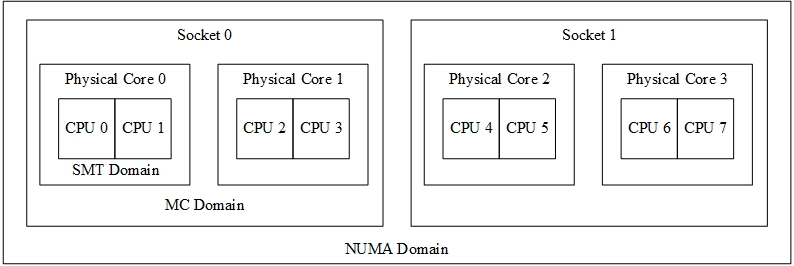

# CPU拓扑结构

# 介绍
&emsp;&emsp;在现代计算机系统中，CPU的拓扑结构是非常复杂的。不同架构的CPU，在拓扑层次上也有很大区别。例如，x86架构，存在逻辑核、物理核和不同Socket上CPU，三种层次。而ARM还有CPU cluster的层次。

&emsp;&emsp;在调度过程中，CPU的拓扑结构会影响任务迁移后的执行效率。例如，在同一个物理核的两个逻辑核间迁移，任务的L1/L2 cache不会发生变动，迁移后执行效率是最高的；而在不同物理核间迁移，L1/L2 cache数据缺失，但是LLC中的数据还能命中，效率是居中的；最后，对于不同Socket上的CPU的任务迁移，不仅所有的cache都会缺失，而且非对称内存之间访问存在远近，会导致最大的延迟。因此，调度子系统必须充分知晓和有效管理CPU拓扑结构，才能很好设计负载均衡。

&emsp;&emsp;Linux内核在调度子系统中使用调度域的概念来描述CPU拓扑结构。以x86架构为例，如图所示，物理核中的两个超线程构成了SMT域，同一Socket中的两个物理核构成了一个MC域，两个Socket构成了NUMA域。

    
     
    
图1. x86架构CPU的基本拓扑结构和调度域

# 源码剖析

# 用户接口
&emsp;&emsp;linux通过文件系统将拓扑结构信息传递给用户态。通过访问/sys/devices/system/cpu/cpuX/topology/下各文件内容，可获取：
* /sys/devices/system/cpu/cpuX/topology/physical_package_id:  
	physical package id of cpuX. Typically corresponds to a physical
	socket number, but the actual value is architecture and platform
	dependent.
* /sys/devices/system/cpu/cpuX/topology/core_id:  
	the CPU core ID of cpuX. Typically it is the hardware platform's
	identifier (rather than the kernel's).  The actual value is
	architecture and platform dependent.
* /sys/devices/system/cpu/cpuX/topology/book_id:  
	the book ID of cpuX. Typically it is the hardware platform's
	identifier (rather than the kernel's).	The actual value is
	architecture and platform dependent.
* /sys/devices/system/cpu/cpuX/topology/drawer_id:  
	the drawer ID of cpuX. Typically it is the hardware platform's
	identifier (rather than the kernel's).	The actual value is
	architecture and platform dependent.
* /sys/devices/system/cpu/cpuX/topology/thread_siblings:  
	internal kernel map of cpuX's hardware threads within the same
	core as cpuX.
* /sys/devices/system/cpu/cpuX/topology/thread_siblings_list:  
	human-readable list of cpuX's hardware threads within the same
	core as cpuX.
* /sys/devices/system/cpu/cpuX/topology/core_siblings:  
	internal kernel map of cpuX's hardware threads within the same
	physical_package_id.
* /sys/devices/system/cpu/cpuX/topology/core_siblings_list:  
	human-readable list of cpuX's hardware threads within the same
	physical_package_id.
* /sys/devices/system/cpu/cpuX/topology/book_siblings:  
	internal kernel map of cpuX's hardware threads within the same
	book_id.
* /sys/devices/system/cpu/cpuX/topology/book_siblings_list:  
	human-readable list of cpuX's hardware threads within the same
	book_id.
* /sys/devices/system/cpu/cpuX/topology/drawer_siblings:  
	internal kernel map of cpuX's hardware threads within the same
	drawer_id.
* /sys/devices/system/cpu/cpuX/topology/drawer_siblings_list:  
	human-readable list of cpuX's hardware threads within the same
	drawer_id.
